<div align="center">

<p>
  <a href="README.md">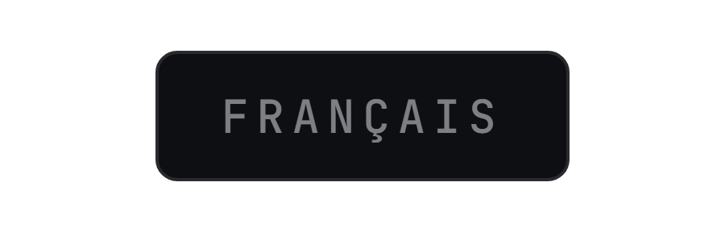</a>
  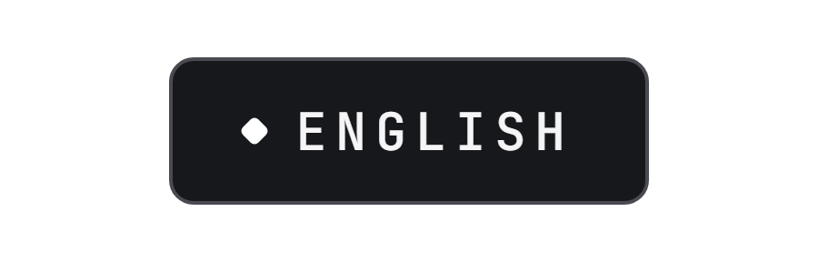
</p>

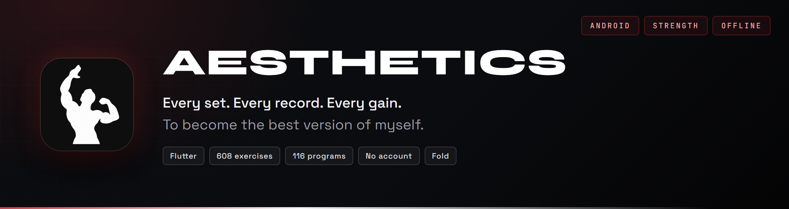

<br><br>

**My strength training app, on Android: the workout, the rest timer, the records, and everything they tell over the months.**

</div>

I train seven times a week, as much strength as cardio, and have more than 460 workouts behind me. The name comes from a movement I love, aesthetics: the one of Zyzz and David Laid, where a physique is built the way a piece of work is crafted. I wanted an app in that image: beautiful, clean, practical, with the body in 3D rather than grey tables.

AESTHETICS does what I need at the gym: log a set in one tap, know what to load, watch a record fall, and understand afterwards what the month added up to.

Everything stays on the phone, in files I can read: no account to create, no server, no locked feature. Black background, grey cards, white buttons; colour is only there to say something.

<p align="center">
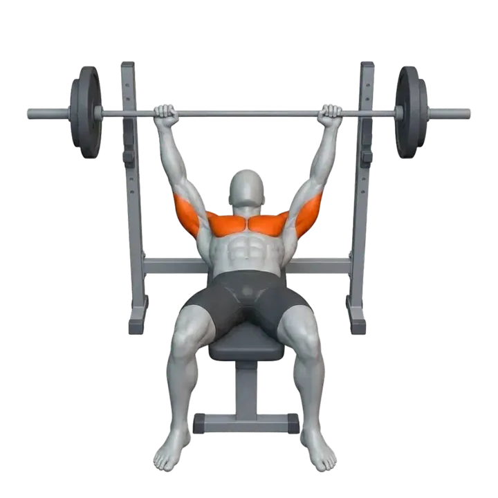
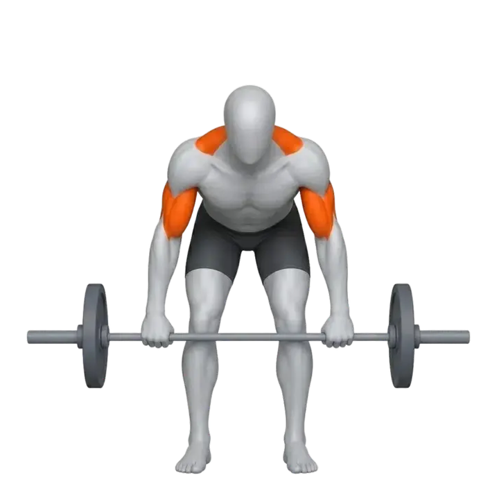
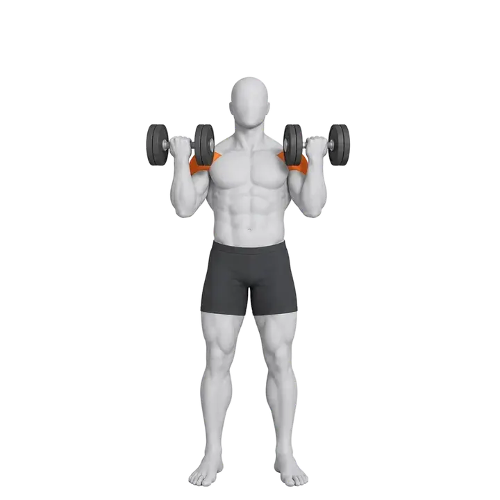
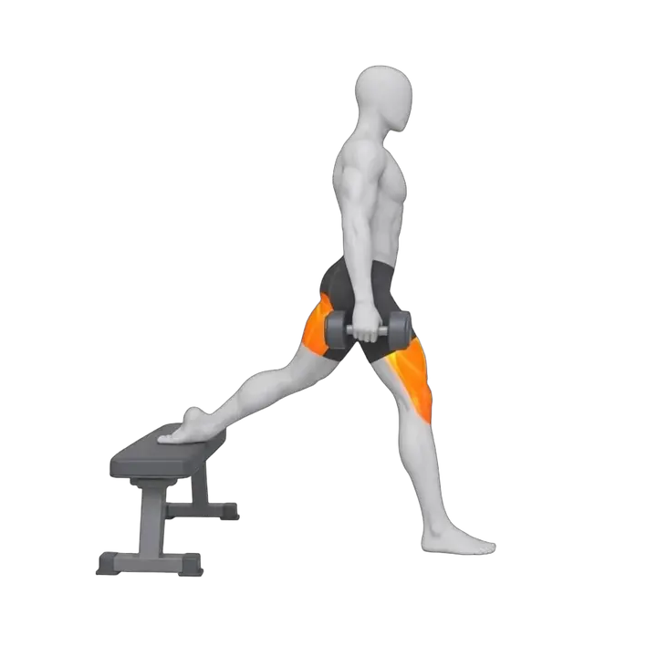
<br>
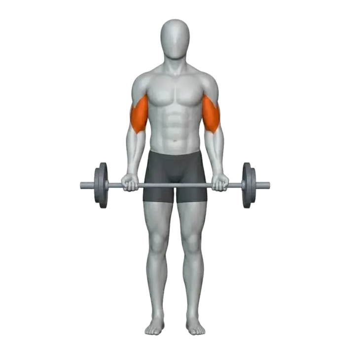
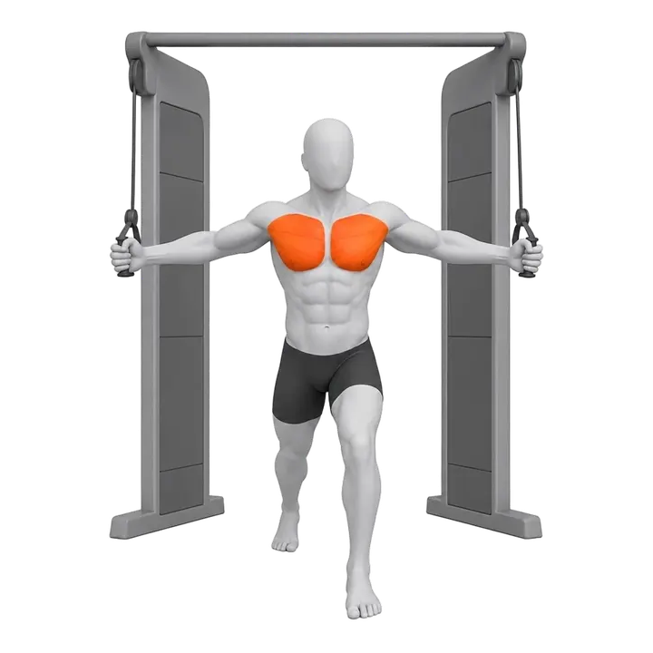
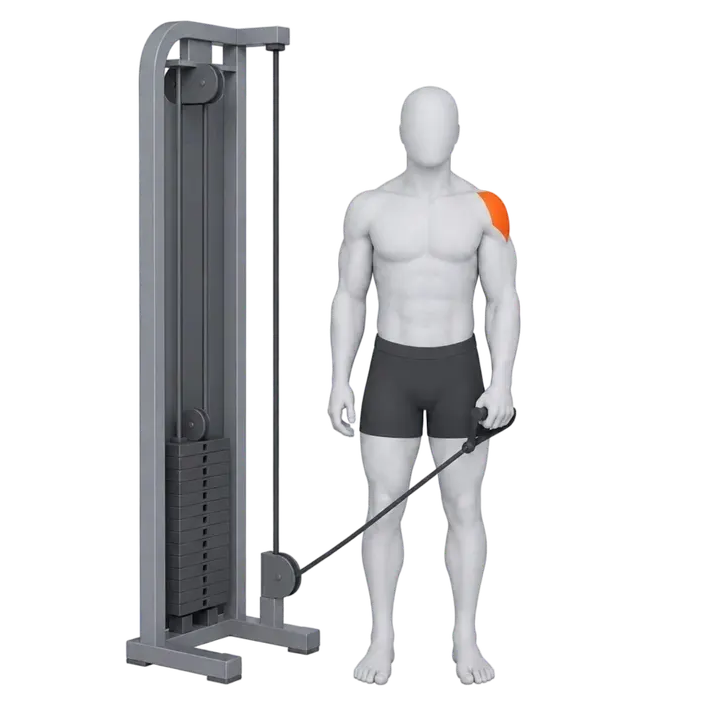
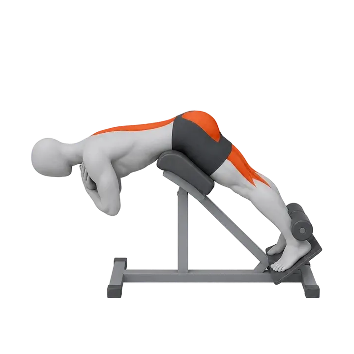
</p>

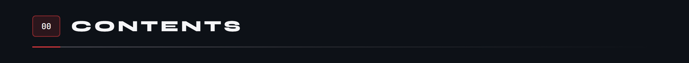

<p align="center">
<a href="#fonctionnalites">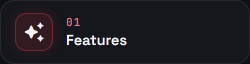</a>
<a href="#ecrans">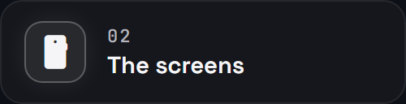</a>
<a href="#seance">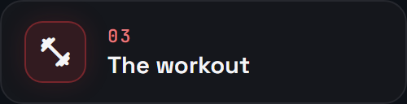</a>
<br>
<a href="#records">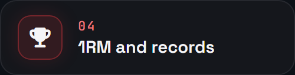</a>
<a href="#programmes">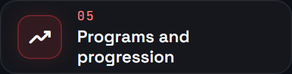</a>
<a href="#exercices">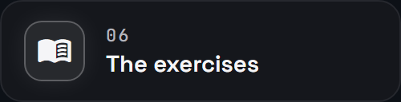</a>
<br>
<a href="#recuperation">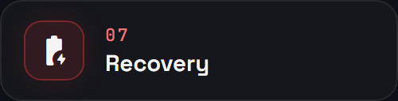</a>
<a href="#serie">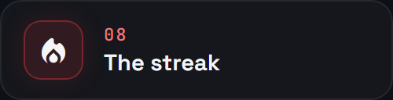</a>
<a href="#resume">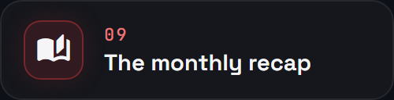</a>
<br>
<a href="#badges">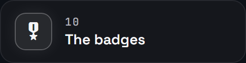</a>
<a href="#import">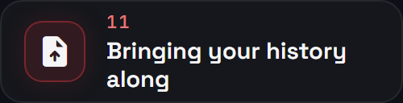</a>
<a href="#donnees">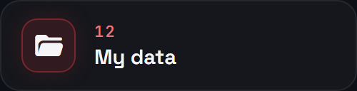</a>
<br>
<a href="#architecture">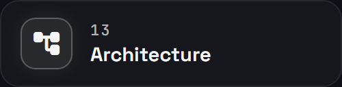</a>
<a href="#tests">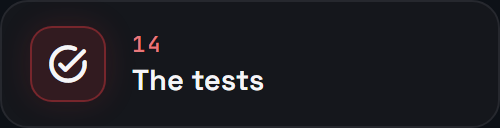</a>
<a href="#construire">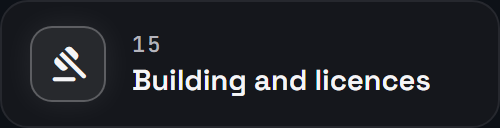</a>
</p>

<a id="fonctionnalites"></a>
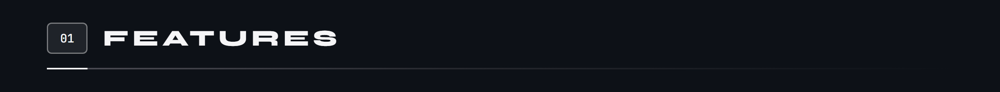


Four tabs are enough: **Home**, **Train**, **Progress**, **Profile**. Nutrition, sleep and a coach exist in the code, shelved behind a build flag: I want a solid strength training app first. The app itself is in French.

<a id="ecrans"></a>
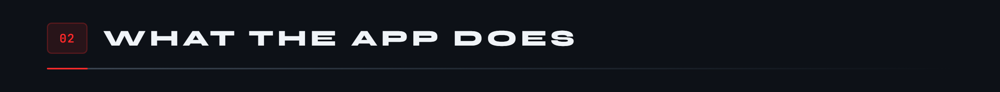

A bar of four tabs at the bottom, and the workout in progress always within reach, shrunk into a thin bar, until it is finished. Every screenshot comes from the app's demo, filled with sample data.


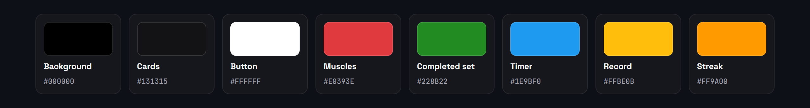

Each colour has one job. Forest green validates a set, blue is reserved for the rest timer, gold for records, orange for the streak, and red for the muscles worked on the character. Main buttons are white with black text. The typeface is Figtree; Montserrat is only used for the big titles of the recap.

<a id="seance"></a>
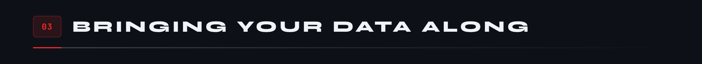


During a workout, everything fits on one screen: tick a set, the rest starts by itself and tells you when it is over. A set that beats what you have already done on the exercise turns gold, and the app says so right away. The workout can shrink into a bar above the tabs without stopping, and every action is written to the phone as it happens: closing the app loses nothing.

Each set has a type, twelve in all: normal, warm-up, drop set, failure, left, right, negative, partials, myo-reps, feeder, top set, back-off. Only the warm-up counts neither in the volume nor in the records. An exercise can be logged in seven ways, from weight and reps to distance and time, and the table changes its columns to match. RPE or RIR can be added as a column.

<details>
<summary><b>Plates and warm-up</b></summary>

The **Plates and warm-up** page opens from an exercise's menu. It says what to load on each side of the bar: the target load minus the bar, divided by two, then plates taken from heaviest to lightest among those you own, never going over the target. If it cannot be reached, the page gives the closest load with that equipment. Bars and plates are set once, in the settings.

It also suggests the warm-up: the empty bar for ten reps, then 40% for eight, 60% for five and 80% for three, rounded to the equipment's step. **Add to the exercise** puts these steps at the top, as warm-up sets.

</details>

<a id="records"></a>
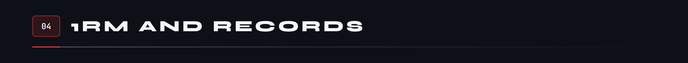


The estimated 1RM comes from two classic formulas, Epley and Brzycki: the app keeps their average up to ten reps, then Epley alone beyond. At the end of each workout, five values per exercise are compared with the best of earlier workouts, and the old one must be beaten, not matched. Warm-up sets count nowhere, and an exercise done for the first time beats no record.

<a id="programmes"></a>
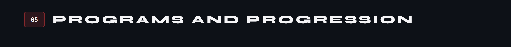

A **routine** is a template workout: its exercises, its sets, its rep ranges. A **programme** arranges routines in a cycle, knows where you are in it, and makes the loads climb. The library offers 116 programme ideas, sorted by shelf: getting started, building muscle, gaining strength, at home with no equipment, with dumbbells, when time is short. Adding one creates its routines, ready to start.


Each programme chooses how its loads evolve: “None”, “Progressive load”, “Double progression” or “Weekly undulating”, with a load increment and, if you want, a deload week every N weeks. When a workout of the programme starts, the app looks at the last time each exercise was done and sets the sets accordingly. The programme week moves forward with finished workouts, not with the calendar. Without a programme, the routine starts as it is.


At the top of the Routines pane, the app only suggests a routine when it is sure: the same routine must have been done on that weekday at least 6 times in the last 8 weeks. “Another one” sets it aside until tomorrow and moves a queue forward: that weekday’s habits, then what comes next in the active programme, then the routine that has waited the longest. Each suggestion shows its reason, and “Start” launches the workout.

<a id="exercices"></a>
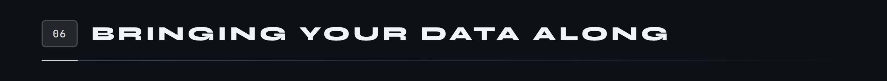

The catalogue holds **608 exercises**, **496 of them animated**; the other 112 are holds and stretches, shown by their pose. Each has its name in French and English, its primary and secondary muscles among twenty, its equipment, its steps and its tips.

- **Search.** The search ignores accents and case, and understands French as well as English, nicknames (“pecs”, “quads”) and equipment. On a tie, the exercise done most often comes first.
- **Filter.** A row of tiles per muscle group, plus Favourites, Cardio and Stretching; a **Filter** panel by equipment, in pictures, with several choices; and the Recent and My exercises chips.
- **Read an exercise.** Four tabs: **About** (the animation, the muscles targeted on the body, how to do it, alternative exercises), **History**, **Progress** (the curve of estimated 1RM, load and volume, from one month to the whole history) and **Records**.
- **Create your own.** A name, a way of logging, the muscles involved on the character, the equipment, a photo or a video. A personal variant is copied from a catalogue exercise in one tap.

<a id="recuperation"></a>
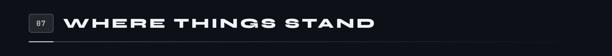


Every completed set tires the muscles of the exercise, fully for a primary muscle, by half for a secondary one; six sets are enough to saturate a muscle. Fatigue then fades in a straight line, over 48, 60 or 72 hours depending on the muscle, and only the workouts of the last 96 hours count. The Recovery page of the Progress tab turns this into a percentage per muscle, green from 90%, orange below, and recommends the group whose least recovered muscle is the most recovered.

<a id="serie"></a>
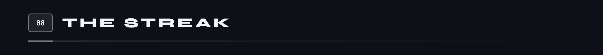


The streak is counted in weeks, not days: a single workout is enough for a week to count, and the weekly workout goal plays no part. The count goes back from the current week, which breaks nothing while it is still empty, and stops at the first week with no workout. The “Streak” page shows the number, the flame and a calendar where each week kept is underlined with a band.

<a id="resume"></a>
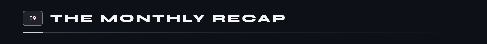


Every finished month has its recap in ten full-screen pages, flipped through by touch, each of which can be shared as an image. The fifth weighs the month’s volume in an object picked from a scale of twenty-five, from the burger to the Statue of Liberty: the object is chosen by a seed derived from the month, so the same recap always reopens on the same object. The yearly recap uses the same ten pages for the whole year.

<a id="badges"></a>
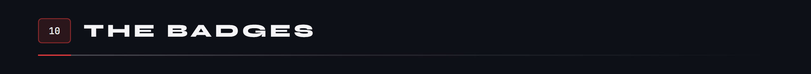


Badges are not claimed: they are recounted from finished workouts, and a badge goes up a level when its counter reaches the next threshold. Nine badges have tiers, six stay secret until their first time, and the milestones only count workouts, from 1 to 2,000. There are no points and no ranks: a crest only says what you have done.

<a id="import"></a>
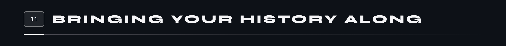


The history from another app comes in through its CSV export: columns are recognised from their headers, in French or English, and each row becomes a set in its workout. Exercise names are then matched to the catalogue, first through a synonym table, then by a likeness score. A name is only accepted on its own from 0.90, with a 0.05 lead over the next one; everything else is shown to you before importing, and your choices are remembered for next time. Any table works too, by saying which column holds what, and every import can be reviewed or undone.

<a id="donnees"></a>
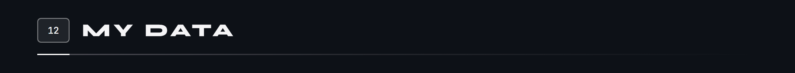


Your data are JSON files stored on the phone, one per collection: no account, no server. The “My data” page lets you export them as CSV or JSON, make a full backup to restore on another phone, and keep quick copies on the device. No backup is automatic: a copy is made when you ask for one, or just before “Erase everything”. If a file can no longer be read, it is set aside without being overwritten and the app tells you when it opens.

<a id="architecture"></a>


AESTHETICS is written in Flutter, with no code generation. Twenty-six packages are imported by the strength training part; the diagram groups them by what they serve, from screen state to the end-of-rest sound. Three more only serve the shelved modules, and two are declared without being imported.


Ticking a set goes through the whole app. The screen hands the action to `SessionRepo`, which keeps the workout in memory, notifies the screen, then writes it to `seance_active.json` atomically: a temporary file, then a rename. The workout in progress therefore survives the app being closed, and the screen never waits for the disk. State relies on `provider` and `ChangeNotifier`.

**The unfolded screen.** Under 600 points wide, the app stays in portrait, like a phone. Beyond that the screen rotates freely, and from 840 points the bottom bar becomes a rail on the left: the workout goes two columns, the library shows the list on the left and the exercise on the right, the history puts the calendar next to the workouts.

<a id="tests"></a>
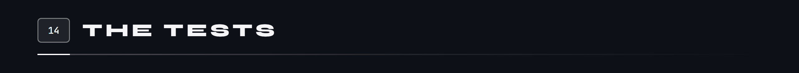


The suite holds 905 test cases written in 98 files, laid out like the code: one folder per module. 875 cover strength training and its foundation, 30 the shelved modules. These numbers are counts in the code (543 `test(` and 362 `testWidgets(`); eight cases are marked `skip`, three of them for known defects.

<a id="construire"></a>
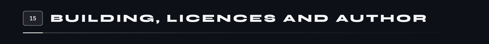

AESTHETICS is not on the Play Store, and no APK is published here for now.

**The code.** For now this repository holds the presentation of the project: the app's code is not published here yet. It is a Flutter app, for Android 8 or later, built with one command:

```
flutter build apk --release --target-platform android-arm64
# the demo: six months of made-up workouts, in a separate data folder
flutter build apk --release --target-platform android-arm64 --dart-define=DEMO=true
```

The demo fills itself with sample data on first launch, without ever touching real data: it is the one used for the screenshots on this page.

**Licences.** The code is under the [MIT](LICENSE) licence. The rest belongs to its authors:

- **The exercises**: the catalogue, the animations, the poses and the character come from a professional pack, used under a commercial Enterprise licence that I purchased. The illustrations shown on this page are shown under that licence: they are not covered by the code's MIT licence and may not be reused.
- **The 3D objects** of the recap and the end-of-workout cards: Microsoft's [Fluent Emoji](https://github.com/microsoft/fluentui-emoji), MIT licence.
- **The badge pictograms**: [Phosphor Icons](https://phosphoricons.com), MIT licence.
- **The typefaces**: Figtree and Montserrat, SIL Open Font License 1.1.
- **The sounds** of the timer and the record: [Pixabay](https://pixabay.com), under its content licence.

Designed and written by **Tristan Joncour**, engineering student in cyber defence at ENSIBS, for his own workouts. My other apps: [SmartBudget](https://github.com/Cybertrist/SmartBudget), [BodyCount](https://github.com/Cybertrist/BodyCount), [Serenity](https://github.com/Cybertrist/Serenity).

<br>

<sub>The images on this page come from no drawing software: they are HTML pages captured by Chrome, and animated SVGs written by <code>anime.js</code> and the modules in <code>schemas/</code>. The screenshots come from an emulator, in the app's demo. Everything is in <a href="docs/tools/">docs/tools</a>.</sub>
