<div align="center">

<p>
  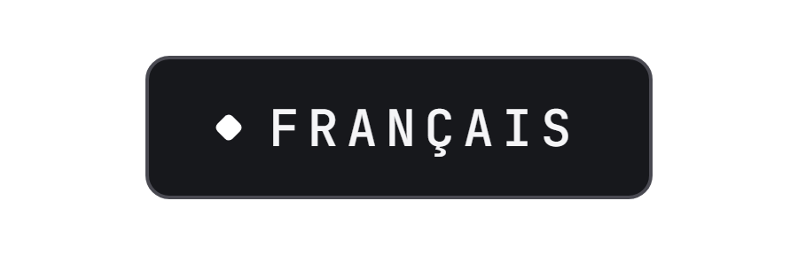
  <a href="README.en.md"></a>
</p>

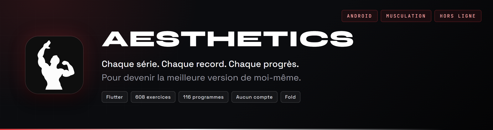

<br><br>

**Je me suis toujours senti mal dans mon corps.<br>C'est le moment d'atteindre mes objectifs.**

</div>

Le nom vient d'un mouvement que j'adore : l'*aesthetics*. Zyzz, David Laid, et une idée simple : un physique se construit, série après série, jusqu'à ressembler à ce qu'on a en tête. AESTHETICS est mon application de musculation sur Android, faite pour ça : belle, propre, pratique, avec le corps en 3D.

Elle fait ce dont j'ai besoin à la salle : noter une série en un geste, savoir quoi charger, voir un record tomber, et comprendre après coup ce que le mois a donné.

Tout reste sur le téléphone, dans des fichiers que je peux lire : aucun compte à créer, aucun serveur, aucune fonction verrouillée. Fond noir, cartes grises, boutons blancs ; la couleur ne sert qu'à dire quelque chose.

<p align="center">


<br>


</p>

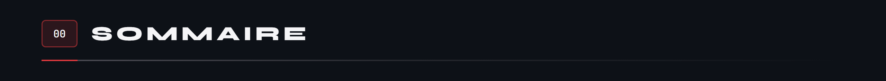

<p align="center">
<a href="#fonctionnalites">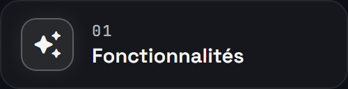</a>
<a href="#ecrans">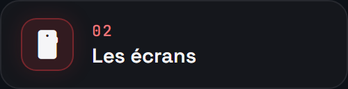</a>
<a href="#seance">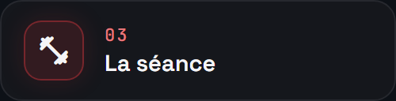</a>
<br>
<a href="#records">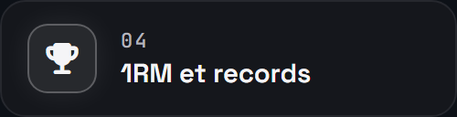</a>
<a href="#programmes">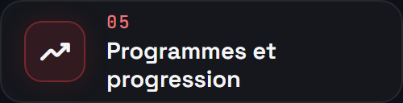</a>
<a href="#exercices">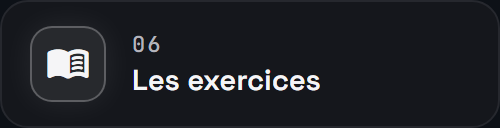</a>
<br>
<a href="#recuperation">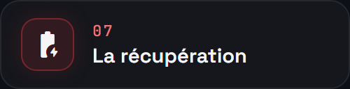</a>
<a href="#serie">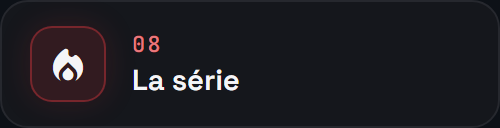</a>
<a href="#resume">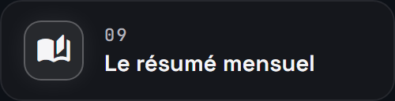</a>
<br>
<a href="#badges">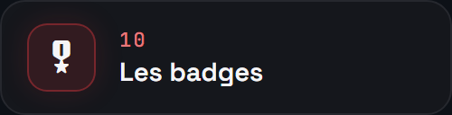</a>
<a href="#import">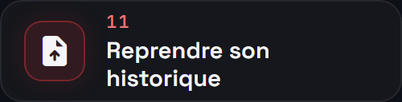</a>
<a href="#donnees">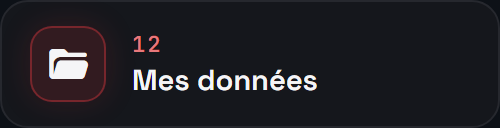</a>
<br>
<a href="#architecture"></a>
<a href="#tests">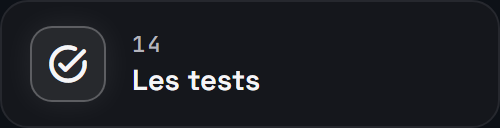</a>
<a href="#construire">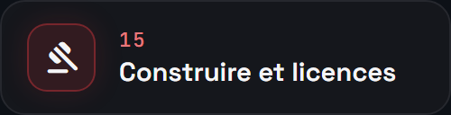</a>
</p>

<a id="fonctionnalites"></a>
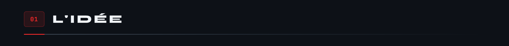


Quatre onglets suffisent : **Accueil**, **Entraîner**, **Progrès**, **Profil**. La nutrition, le sommeil et un coach existent dans le code, rangés derrière un drapeau de construction : je veux d'abord une application de musculation solide.

<a id="ecrans"></a>
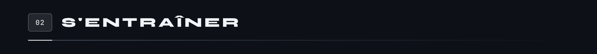

Une barre de quatre onglets en bas, et la séance en cours qui reste à portée, réduite en une barre fine, tant qu'elle n'est pas terminée. Toutes les captures viennent de la démo de l'application, remplie d'un jeu d'essai.


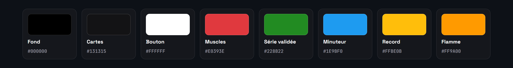

Chaque couleur a un seul métier. Le vert forêt valide une série, le bleu est réservé au minuteur de repos, l'or aux records, l'orange à la série, et le rouge aux muscles travaillés sur le personnage. Les boutons principaux sont blancs, à texte noir. La police est Figtree ; Montserrat ne sert qu'aux gros titres du résumé.

Et sept widgets pour l'écran d'accueil du téléphone. C'est l'application qui les dessine, avec ses propres composants : mêmes icônes, mêmes couleurs, même personnage. Elle en prépare sept jours d'avance, pour que la routine du jour et le jour entouré restent justes sans la rouvrir.


Dans le widget du record, le personnage refait l'exercice en boucle : douze images de son animation, qui défilent.

<div align="center">
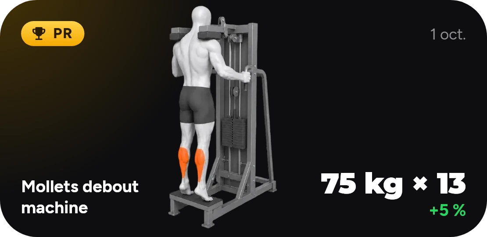
</div>

<a id="seance"></a>
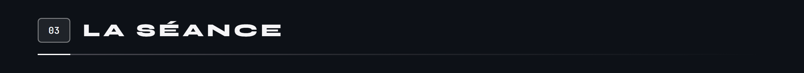


Pendant la séance, tout tient sur un écran : on coche une série, le repos part seul et prévient quand il se termine. Une série qui dépasse ce que tu as déjà fait sur l'exercice passe à l'or, et l'application l'annonce tout de suite. La séance peut se réduire en une barre au-dessus des onglets sans s'arrêter, et chaque geste est écrit sur le téléphone au fur et à mesure : fermer l'application ne perd rien. À la fin, l'application pèse la séance dans un objet, montre en grand les records battus, et dit quoi charger la prochaine fois.

Chaque série porte un type, douze en tout : normale, échauffement, dégressive, échec, gauche, droite, négative, partielles, myo-reps, feeder, top set, back-off. Seul l'échauffement ne compte ni dans le volume ni dans les records. Un exercice se note de sept façons, du poids et des répétitions à la distance et la durée, et le tableau change de colonnes avec lui. Le RPE ou le RIR s'ajoutent en colonne si on les active.

<details>
<summary><b>Disques et échauffement</b></summary>

La page **Disques et échauffement** s'ouvre depuis le menu d'un exercice. Elle dit quoi charger de chaque côté de la barre : la charge visée moins la barre, divisée par deux, puis les disques pris du plus lourd au plus léger parmi ceux qu'on possède, sans jamais dépasser la cible. Si elle n'est pas atteignable, la page donne le plus proche avec ce matériel. Barres et disques se règlent une fois, dans les réglages.

Elle propose aussi l'échauffement : la barre seule pour dix répétitions, puis 40 % pour huit, 60 % pour cinq et 80 % pour trois, arrondis au pas du matériel. **Ajouter à l'exercice** pose ces paliers en tête, en séries d'échauffement.

</details>

<a id="records"></a>
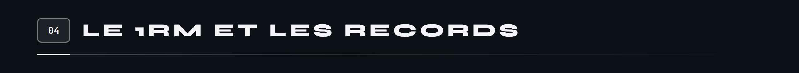


Le 1RM estimé vient de deux formules classiques, Epley et Brzycki : l'application en garde la moyenne jusqu'à dix répétitions, puis Epley seul au-delà. Chaque série validée est comparée à ce que tu as fait avant la séance, et reçoit au plus une médaille, la plus haute : l'or pour une charge jamais soulevée sur l'exercice, l'argent pour un meilleur 1RM estimé, le bronze pour plus de répétitions que jamais à cette charge ou plus lourd. Il faut dépasser, pas égaler. L'échauffement ne compte nulle part, et un exercice fait pour la première fois ne bat aucun record. La règle est la même partout : pendant la séance, à la fin, sur l'accueil et dans les résumés.

<a id="programmes"></a>
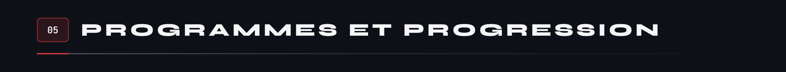

Une **routine** est une séance type : ses exercices, ses séries, ses fourchettes de répétitions. Un **programme** range des routines dans un cycle, sait où l'on en est, et fait monter les charges. La bibliothèque propose 116 idées de programmes, rangées par rayons : pour débuter, prendre du muscle, gagner en force, à la maison sans matériel, avec des haltères, quand le temps manque. En ajouter une crée ses routines, prêtes à lancer.


Chaque programme choisit comment ses charges évoluent : « Aucune », « Charge progressive », « Double progression » ou « Ondulée par semaine », avec un incrément de charge et, si tu veux, une semaine de décharge toutes les N semaines. Au lancement d'une séance du programme, l'application repart de la dernière fois où chaque exercice a été fait et règle les séries en conséquence. La semaine du programme avance avec les séances terminées, pas avec le calendrier. Sans programme, la routine part telle quelle.


En tête du volet Routines, l'application ne propose une routine que si elle est sûre d'elle : la même routine doit avoir été faite ce jour de la semaine au moins 6 fois sur les 8 dernières semaines. « Une autre » l'écarte jusqu'au lendemain et fait avancer une file : les habitudes du jour, puis la suite du programme en cours, puis la routine qui attend depuis le plus longtemps. Chaque proposition affiche sa raison, et « Commencer » lance la séance.

<a id="exercices"></a>
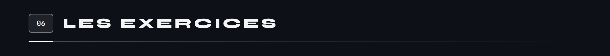

Le catalogue compte **608 exercices**, dont **496 animés** ; les 112 autres sont des maintiens et des étirements, montrés par leur pose. Chacun a son nom en français et en anglais, ses muscles principaux et secondaires parmi vingt, son matériel, ses étapes et ses conseils.

- **Chercher.** La recherche ignore les accents et la casse, et comprend le français comme l'anglais, les surnoms (« pecs », « dorsaux », « quads ») et le matériel. À égalité, l'exercice le plus pratiqué passe devant.
- **Filtrer.** Une rangée de tuiles par groupe musculaire, plus Favoris, Cardio et Étirements ; un panneau **Filtrer** par matériel, en images, à plusieurs choix ; et les puces Récents et Mes exercices.
- **Lire une fiche.** Quatre onglets : **À propos** (l'animation, les muscles ciblés sur le corps, comment faire, les exercices alternatifs), **Historique**, **Progrès** (la courbe du 1RM estimé, de la charge, du volume, sur un mois à tout l'historique) et **Records**.
- **Créer le sien.** Un nom, une façon de noter, les muscles touchés sur le personnage, le matériel, une photo ou une vidéo. Une variante personnelle se copie d'un exercice du catalogue en un geste.

<a id="recuperation"></a>
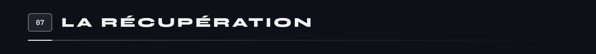


Chaque série validée fatigue les muscles de l'exercice, en entier pour un muscle principal, à moitié pour un secondaire ; six séries suffisent à saturer un muscle. La fatigue s'efface ensuite en ligne droite, sur 48, 60 ou 72 heures selon le muscle, et seules les séances des 96 dernières heures comptent. La page Récupération de l'onglet Progrès en tire un pourcentage par muscle, vert à partir de 90 %, orange en dessous, et conseille le groupe dont le muscle le moins récupéré l'est le plus.

<a id="serie"></a>
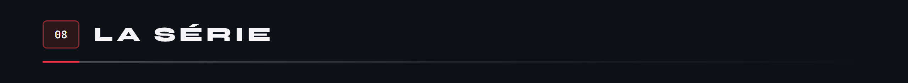


La série se compte en semaines, pas en jours : une seule séance suffit pour qu'une semaine compte, et l'objectif de séances par semaine n'y entre pas. Le compte remonte depuis la semaine en cours, qui ne casse rien tant qu'elle est encore vide, et s'arrête à la première semaine sans séance. La page « Série » montre le chiffre, la flamme et un calendrier où chaque semaine tenue est soulignée d'une bande.

<a id="resume"></a>
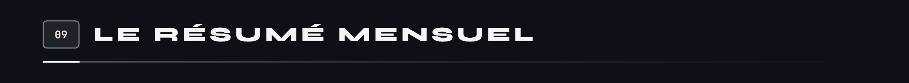


Chaque mois fini a son résumé en dix pages plein écran, qu'on feuillette au toucher et dont chaque page se partage en image. Chaque page se construit en une seconde et demie quand on y arrive : les barres montent, les jours d'entraînement s'allument un par un sur le calendrier, l'objet grossit, les lignes entrent l'une après l'autre. Voici le résumé de septembre et celui de l'année dans la démo, tels que l'application les joue.

<p align="center">
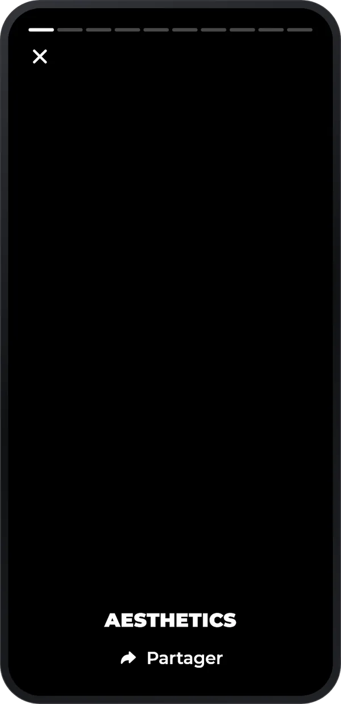
&nbsp;&nbsp;&nbsp;&nbsp;

</p>

La cinquième pèse le volume du mois dans un objet tiré d'une échelle de vingt-cinq, du burger à la statue de la Liberté : l'objet est choisi par une graine tirée du mois, si bien que le même résumé rouvre toujours sur le même objet. Le résumé annuel reprend les mêmes dix pages pour l'année entière, depuis la vue Année de l'onglet Progrès : une ligne par mois, douze mois de cases, la plus longue série de l'année.

<a id="badges"></a>
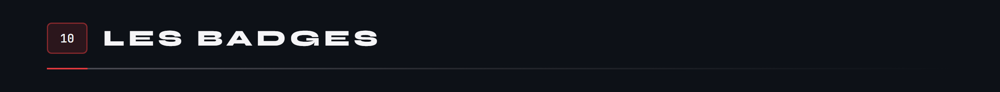


Les badges ne se réclament pas : ils sont recomptés à partir des séances terminées, et un badge monte d'un niveau quand son compteur atteint le seuil suivant. Neuf badges ont des paliers, six restent secrets jusqu'à leur première fois, et les étapes ne comptent que les séances, de 1 à 2 000. Il n'y a ni points ni rang : un écusson dit seulement ce que tu as fait.

<a id="import"></a>
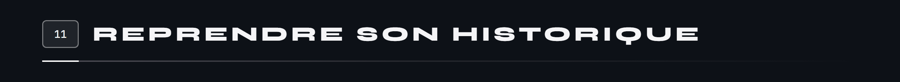


L'historique d'une autre application se reprend depuis son export CSV : les colonnes sont reconnues d'après leurs en-têtes, en français ou en anglais, et chaque ligne devient une série dans sa séance. Les noms d'exercices sont ensuite rapprochés du catalogue, d'abord par une table de synonymes, puis par un score de ressemblance. Un nom n'est accepté seul qu'à partir de 0,90, avec 0,05 d'avance sur le suivant ; tout le reste t'est montré avant d'importer, et tes choix sont retenus pour la fois d'après. Un tableau quelconque passe aussi, en indiquant quelle colonne contient quoi, et chaque import peut être revu ou annulé.

<a id="donnees"></a>
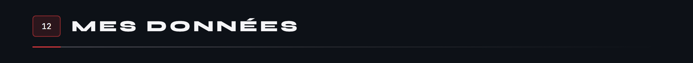


Tes données sont des fichiers JSON rangés sur le téléphone, un par collection : aucun compte, aucun serveur. La page « Mes données » permet de les exporter en CSV ou en JSON, d'en faire une sauvegarde complète à restaurer sur un autre téléphone, et de garder des copies rapides sur l'appareil. Aucune sauvegarde n'est automatique : une copie se fait quand tu la demandes, ou juste avant « Tout effacer ». Si un fichier ne se relit plus, il est mis de côté sans être écrasé et l'application te le dit à l'ouverture.

<a id="architecture"></a>
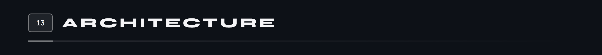


AESTHETICS est écrite en Flutter, sans génération de code. Vingt-six paquets sont importés par la partie musculation ; le schéma les range par ce qu'ils servent, de l'état de l'écran jusqu'au son de fin de repos. Trois autres ne servent qu'aux modules rangés, et deux sont déclarés sans être importés.


Cocher une série traverse toute l'application. L'écran confie le geste à `SessionRepo`, qui garde la séance en mémoire, prévient l'écran, puis l'écrit dans `seance_active.json` par une écriture atomique : un fichier temporaire, puis un renommage. La séance en cours survit donc à la fermeture de l'application, et l'écran n'attend jamais le disque. L'état repose sur `provider` et `ChangeNotifier`.

**L'écran déplié.** Sous 600 points de large, l'application reste en portrait, comme un téléphone. Au-delà, l'écran tourne librement, et dès 840 points la barre du bas devient un rail à gauche : la séance passe en deux colonnes, la bibliothèque montre la liste à gauche et la fiche à droite, l'historique met le calendrier à côté des séances.

<a id="tests"></a>
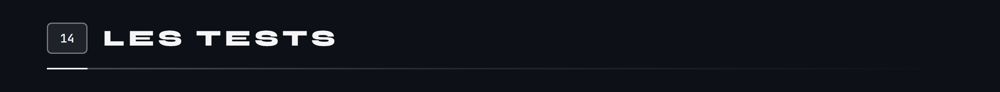


La suite compte 925 cas de test écrits dans 102 fichiers, rangés comme le code : un dossier par module. 895 portent sur la musculation et son socle, 30 sur les modules rangés. Ces nombres sont des comptages dans le code (557 `test(` et 368 `testWidgets(`) ; dix cas sont marqués `skip`, dont trois pour des défauts connus.

<a id="construire"></a>
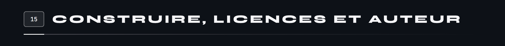

AESTHETICS n'est pas sur le Play Store, et aucun APK n'est publié ici pour l'instant.

**Le code.** Ce dépôt porte pour l'instant la présentation du projet : le code de l'application n'y est pas encore publié. C'est une application Flutter, pour Android 8 ou plus, qui se construit en une commande :

```
flutter build apk --release --target-platform android-arm64
# la démo : six mois de séances inventées, dans un dossier de données à part
flutter build apk --release --target-platform android-arm64 --dart-define=DEMO=true
```

La démo se remplit d'un jeu d'essai au premier lancement, sans jamais toucher aux vraies données : c'est elle qui a servi aux captures de cette page.

**Les licences.** Le code est sous licence [MIT](LICENSE). Le reste appartient à ses auteurs :

- **Les exercices** : le catalogue, les animations, les poses et le personnage viennent d'un pack professionnel, utilisé sous une licence commerciale Enterprise que j'ai acquise. Les illustrations montrées sur cette page le sont à ce titre : elles ne sont pas couvertes par la licence MIT du code et ne peuvent pas être reprises.
- **Les objets en 3D** du résumé et des cartes de fin de séance : [Fluent Emoji](https://github.com/microsoft/fluentui-emoji) de Microsoft, licence MIT.
- **Les pictogrammes des badges** : [Phosphor Icons](https://phosphoricons.com), licence MIT.
- **Les polices** : Figtree et Montserrat, licence SIL Open Font 1.1.
- **Les sons** du minuteur et du record : [Pixabay](https://pixabay.com), sous sa licence de contenu.

Conçu et écrit par **Tristan Joncour**, élève ingénieur en cyberdéfense à l'ENSIBS, pour ses propres séances. Mes autres applications : [SmartBudget](https://github.com/Cybertrist/SmartBudget), [BodyCount](https://github.com/Cybertrist/BodyCount), [Serenity](https://github.com/Cybertrist/Serenity).

<br>

<sub>Les images de cette page ne sortent d'aucun logiciel de dessin : ce sont des pages HTML que Chrome capture, et des SVG animés écrits par <code>anime.js</code> et les modules de <code>schemas/</code>. Les captures viennent d'un émulateur, dans la démo de l'application, et les résumés animés d'un test qui la filme image par image. Tout est dans <a href="docs/tools/">docs/tools</a>.</sub>
